# Advanced Hypervisor-Based DRM Bypass Research

> **Academic Research Project**: Comprehensive analysis of hardware virtualization techniques for anti-tamper circumvention

[](https://opensource.org/licenses/MIT)
[](https://github.com)
[](https://github.com)

---

## 📋 Table of Contents

- [Executive Summary](#executive-summary)
- [CPU Privilege Ring Architecture](#cpu-privilege-ring-architecture)
- [Hypervisor Attack Surface](#hypervisor-attack-surface)
- [Technical Implementation Analysis](#technical-implementation-analysis)
- [Ring-Level Component Breakdown](#ring-level-component-breakdown)
- [DRM Detection Mechanisms](#drm-detection-mechanisms)
- [Evasion Techniques Comparison](#evasion-techniques-comparison)
- [Architecture Diagrams](#architecture-diagrams)
- [Security Implications](#security-implications)
- [Alternative Approaches](#alternative-approaches)
- [Research Methodology](#research-methodology)
- [References](#references)

---

## 🎯 Executive Summary

This repository contains comprehensive research on hardware virtualization techniques used to bypass modern Digital Rights Management (DRM) systems, specifically Denuvo Anti-Tamper. The analysis covers multi-layer attack chains spanning four CPU privilege levels:

### Architecture Overview


*Hardware fingerprinting attack surface used by modern DRM systems*


*Evolution of DRM detection vs. hypervisor evasion techniques (2014-2026)*

| Privilege Level | Ring | Component Type | Primary Function |
|----------------|------|----------------|------------------|
| **UEFI Firmware** | Ring -2 | UEFI DXE Driver | Boot-level security bypass (PatchGuard, DSE) |
| **Hypervisor** | Ring -1 | VMX/SVM Monitor | Hardware instruction interception |
| **Kernel Mode** | Ring 0 | Device Drivers | Kernel structure manipulation |
| **User Mode** | Ring 3 | DLL Injection | API hooking and process emulation |

**Research Focus**: Understanding the technical capabilities and limitations of each privilege level, the detection mechanisms employed by modern anti-tamper systems, and the architectural trade-offs between different bypass approaches.

---

## 🔐 CPU Privilege Ring Architecture

### Traditional Ring Model

```
┌─────────────────────────────────────────────────┐
│  Ring -2 (SMM/UEFI)  - Firmware Execution       │
│  ▲ Highest Privilege - Pre-OS Boot              │
└──────────────────┬──────────────────────────────┘
                   │
┌─────────────────────────────────────────────────┐
│  Ring -1 (Hypervisor)  - VMX/SVM Root Mode      │
│  ▲ Hardware Virtualization - VM Control         │
└──────────────────┬──────────────────────────────┘
                   │
┌─────────────────────────────────────────────────┐
│  Ring 0 (Kernel)  - OS Kernel & Drivers         │
│  ▲ Full System Access - Protected Memory        │
└──────────────────┬──────────────────────────────┘
                   │
┌─────────────────────────────────────────────────┐
│  Ring 1 & 2  - Historically unused on x86       │
│  (Reserved for OS services, now obsolete)       │
└──────────────────┬──────────────────────────────┘
                   │
┌─────────────────────────────────────────────────┐
│  Ring 3 (User)  - Application Execution         │
│  ▼ Lowest Privilege - Sandboxed Processes       │
└─────────────────────────────────────────────────┘
```

### Extended Privilege Levels for DRM Bypass

| Ring | Official Name | Access Rights | DRM Bypass Capabilities | Detection Difficulty |
|------|---------------|---------------|-------------------------|---------------------|
| **-2** | System Management Mode (SMM) / UEFI Runtime | Firmware-level, pre-OS boot control | Disable secure boot chain, patch boot components, modify NVRAM variables | Extremely High - requires firmware TPM attestation |
| **-1** | VMX Root / SVM Host | Hardware virtualization, intercept all VM instructions | CPUID spoofing, MSR hiding, memory virtualization, instruction emulation | Very High - requires nested virtualization detection |
| **0** | Kernel Mode | Full OS control, direct hardware access | Driver signature bypass, kernel structure manipulation, callback installation | High - kernel-mode anti-cheat detection |
| **3** | User Mode | Sandboxed execution, API-level access | DLL injection, API hooking, memory patching, IAT manipulation | Medium - user-mode scanners, integrity checks |

---

## 🎮 Hypervisor Attack Surface

### Modern DRM Protection Layers

Denuvo Anti-Tamper typically operates with multiple protection layers:

```
┌─────────────────────────────────────────────────────┐
│         Application Layer (Ring 3)                  │
│  ┌─────────────────────────────────────────────┐    │
│  │  Game Executable + Denuvo Wrapper           │    │
│  │  - Mutated Bytecode (MBA) Virtual Machine   │    │
│  │  - Hardware Fingerprinting Probes           │    │
│  │  - License Token Verification               │    │
│  └─────────────────────────────────────────────┘    │
└─────────────────────────────────────────────────────┘
                      ↓ Queries
┌─────────────────────────────────────────────────────┐
│         Windows API Layer                           │
│  - CPUID instruction (CPU identification)           │
│  - XGETBV (Extended feature detection)              │
│  - NtQuerySystemInformation (Kernel queries)        │
│  - Registry (Hardware configuration)                │
└─────────────────────────────────────────────────────┘
                      ↓ System Calls
┌─────────────────────────────────────────────────────┐
│         Kernel Layer (Ring 0)                       │
│  - KUSER_SHARED_DATA (0x7FFE0000)                   │
│  - Performance Counters (RDTSC, RDPMC)              │
│  - Kernel Debugger Detection                        │
│  - Driver Enumeration                               │
└─────────────────────────────────────────────────────┘
                      ↓ Hardware Instructions
┌─────────────────────────────────────────────────────┐
│         Hardware Layer (CPU Features)               │
│  - CPU Model/Family/Stepping (CPUID 0x01)           │
│  - Virtualization Features (CPUID 0x01, ECX bit 5)  │
│  - Extended Features (CPUID 0x07)                   │
│  - MSR Registers (Model-Specific Registers)         │
└─────────────────────────────────────────────────────┘
```

### Denuvo Detection Points

| Layer | Detection Method | Information Gathered | Bypass Requirement |
|-------|-----------------|---------------------|-------------------|
| **CPUID Leaf 0x01** | Processor Info and Features | Family, Model, Stepping, Brand, HyperThreading, SSE/AVX support | Must return consistent fake values |
| **CPUID Leaf 0x40000000** | Hypervisor Detection | Hypervisor presence flag, vendor signature | Must hide or fake hypervisor vendor |
| **RDTSC/RDTSCP** | Timestamp Counter | CPU cycle count (timing attacks) | Must provide linear, consistent values |
| **RDPMC** | Performance Monitoring | Performance counter values | Must spoof or disable counter access |
| **XGETBV** | Extended State | AVX/AVX2/AVX512 state bits | Must match CPUID feature claims |
| **MSR 0x1A0** | IA32_MISC_ENABLE | Misc. CPU features, SpeedStep, TurboBoost | Must return expected values |
| **MSR 0x3A** | IA32_FEATURE_CONTROL | VMX lock bit, BIOS control | Must show virtualization disabled |
| **KUSER_SHARED_DATA** | Kernel Shared Memory | System time, CPU features, boot ID | Must be continuously spoofed |
| **NtQuerySystemInformation** | Kernel Queries | Debugger presence, kernel modules | Must intercept and fake responses |

---

## 🛠 Technical Implementation Analysis

### Component Architecture

#### 1. **Ring -2: UEFI Bootkit (EfiGuard)**

**Purpose**: Disable Windows security features before the OS kernel loads

**Key Functions**:
```c
// Pseudocode from decompilation analysis
EFI_STATUS EfiGuardDxeEntry(EFI_HANDLE ImageHandle, EFI_SYSTEM_TABLE *SystemTable) {
    // Hook boot services
    HookBootServices(SystemTable->BootServices);
    
    // Locate Windows Boot Loader (bootmgr)
    FindWindowsBootLoader();
    
    // Patch PatchGuard initialization
    PatchPatchGuardInit();
    
    // Disable Driver Signature Enforcement (DSE)
    DisableDSE();
    
    // Hook ExitBootServices to persist patches
    HookExitBootServices();
    
    return EFI_SUCCESS;
}
```

**Patches Applied**:
- **PatchGuard Disable**: Patches `KiFilterFiberContext` and `KdDebuggerEnabled` to prevent Kernel Patch Protection activation
- **DSE Disable**: Modifies `g_CiOptions` variable to allow unsigned drivers
- **Secure Boot Bypass**: Skips signature verification for boot components

**Persistence**: Runs on every boot via UEFI DXE (Driver Execution Environment) phase

---

#### 2. **Ring -1: Hardware Hypervisor (SimpleSvm/HyperDbg)**

**AMD Path (SimpleSvm.sys)**:
```c
// SVM (Secure Virtual Machine) initialization
NTSTATUS SimpleSvmInitialize() {
    // Enable SVM in EFER MSR
    __writemsr(IA32_EFER, __readmsr(IA32_EFER) | EFER_SVME);
    
    // Allocate VMCB (Virtual Machine Control Block)
    PVMCB vmcb = AllocateVmcb();
    
    // Configure intercepts
    vmcb->InterceptCPUID = 1;      // Trap CPUID instructions
    vmcb->InterceptMSR = 1;        // Trap MSR reads/writes
    vmcb->InterceptRDTSC = 1;      // Trap timestamp counters
    
    // Launch SVM hypervisor
    __svm_vmrun(vmcb);
    
    return STATUS_SUCCESS;
}
```

**Intel Path (hyperkd.sys + hyperhv.dll)**:
```c
// VMX (Virtual Machine Extensions) initialization
NTSTATUS HyperDbgInitializeVmm() {
    // Enable VMX in CR4
    __writecr4(__readcr4() | CR4_VMXE);
    
    // Enter VMX operation
    __vmx_on(&vmxon_region);
    
    // Configure VMCS (Virtual Machine Control Structure)
    __vmx_vmwrite(CPU_BASED_VM_EXEC_CONTROL, 
        CPU_BASED_HLT_EXITING |
        CPU_BASED_CPUID_EXITING |
        CPU_BASED_RDTSC_EXITING |
        CPU_BASED_MSR_EXITING);
    
    // Launch VM
    __vmx_vmlaunch();
    
    return STATUS_SUCCESS;
}
```

**Interception Handler**:
```c
// VM-Exit handler for CPUID interception
void HandleCPUIDExit(GUEST_STATE *guest) {
    UINT32 leaf = guest->rax;
    UINT32 subleaf = guest->rcx;
    
    switch(leaf) {
        case 0x00000001:  // Processor Info and Features
            // Hide hypervisor bit (ECX bit 31)
            guest->rcx &= ~(1 << 31);
            
            // Hide AVX if not supported
            if (!SupportsAVX()) {
                guest->rcx &= ~(1 << 28);
            }
            break;
            
        case 0x40000000:  // Hypervisor CPUID leaf
            // Return fake "no hypervisor" response
            guest->rax = 0;
            guest->rbx = 0;
            guest->rcx = 0;
            guest->rdx = 0;
            break;
            
        case 0x69696969:  // Magic backdoor CPUID
            // User-mode communication channel
            HandleBackdoorCommand(guest->rbx);
            break;
    }
    
    // Advance RIP past CPUID instruction
    guest->rip += 2;  // CPUID is 2 bytes (0F A2)
}
```

**KUSER_SHARED_DATA Spoofing**:
```c
// Continuously update fake system information
void KUSERSpoofingThread() {
    // Map KUSER_SHARED_DATA (0x7FFE0000) via MDL
    PVOID kuser = MapKUSER();
    
    while (game_running) {
        // Spoof system time (prevent timing attacks)
        *(UINT64*)(kuser + 0x14) = GetFakeSystemTime();
        
        // Spoof interrupt time
        *(UINT64*)(kuser + 0x08) = GetFakeInterruptTime();
        
        // Spoof tick count
        *(UINT32*)(kuser + 0x320) = GetFakeTickCount();
        
        // Hide debugger flag
        *(UINT8*)(kuser + 0x2D4) = 0;
        
        Sleep(1);  // Update every millisecond
    }
}
```

---

#### 3. **Ring 0: Kernel Driver Support**

**Driver Installation Without DSE**:
```c
// Alternative DSE bypass using UEFI runtime variable
NTSTATUS BypassDSEWithUEFI() {
    // Set UEFI variable to disable DSE
    UEFI_VARIABLE var = {
        .VendorGuid = CUSTOM_GUID,
        .Name = L"DSEBypass",
        .Attributes = EFI_VARIABLE_BOOTSERVICE_ACCESS | EFI_VARIABLE_RUNTIME_ACCESS,
        .Data = 0xDEADC0DE  // Magic value
    };
    
    // Call UEFI runtime service
    NtSetSystemEnvironmentValueEx(&var);
    
    return STATUS_SUCCESS;
}
```

**Kernel Callbacks**:
```c
// Monitor process creation for game detection
void ProcessNotifyCallback(HANDLE ParentId, HANDLE ProcessId, BOOLEAN Create) {
    if (Create) {
        PEPROCESS Process;
        if (PsLookupProcessByProcessId(ProcessId, &Process) == STATUS_SUCCESS) {
            // Check if this is the target game
            PUNICODE_STRING imageName = GetProcessImageName(Process);
            
            if (wcsstr(imageName->Buffer, L"Game.exe")) {
                // Start KUSER spoofing for this PID
                StartKUSERSpoof(ProcessId);
                
                // Install inline hooks
                InstallGameHooks(ProcessId);
            }
            
            ObDereferenceObject(Process);
        }
    }
}
```

---

#### 4. **Ring 3: User-Mode Injection**

**DLL Proxy Chain**:
```c
// version.dll proxy loader
BOOL WINAPI DllMain(HINSTANCE hinstDLL, DWORD fdwReason, LPVOID lpvReserved) {
    if (fdwReason == DLL_PROCESS_ATTACH) {
        // Load original version.dll
        HMODULE realDll = LoadLibrary("C:\\Windows\\System32\\version.dll");
        
        // Forward all exports
        ForwardExports(realDll);
        
        // Load emulator DLL
        LoadLibrary("lightemu.dll");
        
        // Load Steam emulator
        LoadLibrary("coldclient\\steamclient64.dll");
    }
    
    return TRUE;
}
```

**IAT Hooking**:
```c
// Hook Import Address Table
void HookGameIAT() {
    HMODULE gameModule = GetModuleHandle(NULL);
    
    // Hook critical APIs
    HookImport(gameModule, "kernel32.dll", "GetTickCount", FakeGetTickCount);
    HookImport(gameModule, "kernel32.dll", "GetSystemTime", FakeGetSystemTime);
    HookImport(gameModule, "ntdll.dll", "NtQuerySystemInformation", FakeNtQuerySystemInformation);
    
    // Hook registry APIs for hardware fingerprinting
    HookImport(gameModule, "advapi32.dll", "RegOpenKeyExW", FakeRegOpenKeyExW);
    HookImport(gameModule, "advapi32.dll", "RegQueryValueExW", FakeRegQueryValueExW);
}
```

**Vectored Exception Handler**:
```c
// Catch privileged instructions that would normally fault
LONG CALLBACK VectoredExceptionHandler(PEXCEPTION_POINTERS ExceptionInfo) {
    PCONTEXT ctx = ExceptionInfo->ContextRecord;
    
    // Check if this is a privileged instruction exception
    if (ExceptionInfo->ExceptionRecord->ExceptionCode == EXCEPTION_PRIV_INSTRUCTION) {
        PBYTE rip = (PBYTE)ctx->Rip;
        
        // Check for CPUID (0F A2)
        if (rip[0] == 0x0F && rip[1] == 0xA2) {
            // Emulate CPUID
            EmulateCPUID(ctx);
            ctx->Rip += 2;
            return EXCEPTION_CONTINUE_EXECUTION;
        }
        
        // Check for RDTSC (0F 31)
        if (rip[0] == 0x0F && rip[1] == 0x31) {
            // Emulate RDTSC
            EmulateRDTSC(ctx);
            ctx->Rip += 2;
            return EXCEPTION_CONTINUE_EXECUTION;
        }
    }
    
    return EXCEPTION_CONTINUE_SEARCH;
}
```

---

## 📊 Ring-Level Component Breakdown

### Comprehensive Capability Matrix

| Capability | Ring -2 (UEFI) | Ring -1 (Hypervisor) | Ring 0 (Kernel) | Ring 3 (User) |
|-----------|----------------|---------------------|----------------|---------------|
| **Boot-level Modification** | ✅ Full control | ❌ No access | ❌ No access | ❌ No access |
| **PatchGuard Disable** | ✅ Before OS load | ⚠️ Conflict risk | ❌ Detected/BSOD | ❌ No access |
| **CPUID Interception** | ❌ Too early | ✅ Hardware trap | ⚠️ VM exit hook | ⚠️ VEH emulation |
| **MSR Interception** | ❌ Too early | ✅ Full control | ⚠️ Limited | ❌ Privilege required |
| **Memory Virtualization** | ❌ No MMU access | ✅ EPT/NPT control | ⚠️ MDL mapping | ⚠️ VirtualProtect only |
| **Timing Attack Mitigation** | ❌ No runtime | ✅ RDTSC intercept | ⚠️ Hook only | ⚠️ API hook only |
| **Hide From Scans** | ✅ Pre-OS | ✅ Can hide self | ⚠️ Rootkit tech | ❌ Easy to detect |
| **System Stability** | ⚠️ Can break boot | ⚠️ VM exit bugs | ⚠️ BSOD risk | ✅ Process crash only |
| **VBS/HVCI Compatibility** | ❌ Must disable | ❌ Conflicts | ⚠️ Signed only | ✅ Compatible |
| **Portability** | ❌ BIOS-specific | ⚠️ CPU-specific | ⚠️ Driver install | ✅ DLL drop |

**Legend**: ✅ Fully Capable | ⚠️ Partial/Risky | ❌ Not Capable

---

### Attack Chain Flow

```
┌──────────────────────────────────────────────────────────────┐
│  1. SYSTEM BOOT (Ring -2)                                    │
│  ┌────────────────────────────────────────────────────────┐  │
│  │  UEFI Firmware → EfiGuardDxe.efi Loads                 │  │
│  │  • Patches PatchGuard init code                        │  │
│  │  • Disables DSE (Driver Signature Enforcement)         │  │
│  │  • Hooks ExitBootServices for persistence              │  │
│  └────────────────────────────────────────────────────────┘  │
└──────────────────┬───────────────────────────────────────────┘
                   ▼
┌──────────────────────────────────────────────────────────────┐
│  2. WINDOWS BOOT (Ring 0 → Ring -1)                          │
│  ┌────────────────────────────────────────────────────────┐  │
│  │  Windows Kernel Loads → Drivers Initialize             │  │
│  │  • SimpleSvm.sys (AMD) OR hyperkd.sys (Intel) loads    │  │
│  │  • VMRUN/VMLAUNCH executed → CPU enters VMX/SVM mode   │  │
│  │  • Hypervisor intercepts: CPUID, MSR, RDTSC, XGETBV    │  │
│  │  • KUSER spoofing thread starts                        │  │
│  └────────────────────────────────────────────────────────┘  │
└──────────────────┬───────────────────────────────────────────┘
                   ▼
┌──────────────────────────────────────────────────────────────┐
│  3. GAME LAUNCH (Ring 3 Injection)                           │
│  ┌────────────────────────────────────────────────────────┐  │
│  │  Game.exe Starts → Loads version.dll (proxy DLL)       │  │
│  │  • Proxy forwards to real version.dll                  │  │
│  │  • Loads lightemu.dll (core emulator)                  │  │
│  │  • Loads steamclient64.dll (Goldberg emulator)         │  │
│  │  • Installs IAT hooks (GetTickCount, QueryPerformance) │  │
│  │  • Registers VEH handler for instruction emulation     │  │
│  │  • Creates fake Steam.exe process tree (ColdLoader)    │  │
│  └────────────────────────────────────────────────────────┘  │
└──────────────────┬───────────────────────────────────────────┘
                   ▼
┌──────────────────────────────────────────────────────────────┐
│  4. DENUVO INITIALIZATION (Multi-Ring Defense)               │
│  ┌────────────────────────────────────────────────────────┐  │
│  │  Denuvo Wrapper Activates → Hardware Fingerprinting    │  │
│  │                                                        │  │
│  │  [Ring 3] Game executes CPUID → [Ring -1] Hypervisor   │  │
│  │           intercepts → Returns fake CPU info           │  │
│  │                                                        │  │
│  │  [Ring 3] Game reads KUSER_SHARED_DATA →               │  │
│  │           [Ring 0] Spoofing thread provides fake time  │  │
│  │                                                        │  │
│  │  [Ring 3] Game calls NtQuerySystemInformation →        │  │
│  │           [Ring 3] IAT hook returns fake "no debugger" │  │
│  │                                                        │  │
│  │  [Ring 3] Game queries registry for hardware →         │  │
│  │           [Ring 3] IAT hook returns consistent values  │  │
│  │                                                        │  │
│  │  [Ring 3] Game validates Steam license →               │  │
│  │           [Ring 3] Goldberg emulator provides fake     │  │
│  │                    steamclient responses               │  │
│  └────────────────────────────────────────────────────────┘  │
└──────────────────┬───────────────────────────────────────────┘
                   ▼
┌──────────────────────────────────────────────────────────────┐
│  5. GAME EXECUTION (All Defenses Active)                     │
│  └────────────────────────────────────────────────────────┘  │
│     Game runs with spoofed environment across 4 ring levels  │
└──────────────────────────────────────────────────────────────┘
```

---

## 🎯 DRM Detection Mechanisms

### Denuvo Anti-Tamper Detection Strategy

| Detection Category | Techniques | Purpose | Bypass Difficulty |
|-------------------|------------|---------|------------------|
| **Hypervisor Detection** | CPUID leaf 0x40000000, CPUID bit 31 (ECX), VMX/SVM feature bits | Detect if running in VM | High |
| **Timing Anomalies** | RDTSC delta analysis, instruction timing, cache timing | Detect emulation overhead | Very High |
| **Memory Integrity** | CRC32/SHA256 of code sections, import table validation | Detect code modification | Medium |
| **Debugger Detection** | IsDebuggerPresent, CheckRemoteDebuggerPresent, NtQueryInformationProcess | Detect debugging | Low |
| **Hardware Fingerprinting** | CPU model/stepping, disk serial, MAC address, GPU info | Create unique machine ID | High |
| **Module Enumeration** | EnumProcessModules, PEB walk, LDR_DATA_TABLE_ENTRY scan | Detect injected DLLs | Medium |
| **Kernel Queries** | NtQuerySystemInformation class 35 (modules), class 44 (debugger) | Detect kernel mods | High |
| **Process Tree Validation** | Check for steam.exe parent, validate Steam client | Verify legitimate Steam | Medium |
| **License Token Validation** | Hardware-bound encrypted token, periodic server validation | Verify ownership | Very High |

### Detection Evasion Requirements

```
┌─────────────────────────────────────────────────────────────┐
│  HYPERVISOR DETECTION EVASION                               │
├─────────────────────────────────────────────────────────────┤
│  ✓ CPUID 0x40000000 returns (0, 0, 0, 0) → "No hypervisor" │
│  ✓ CPUID 0x01 ECX bit 31 = 0 → Hide hypervisor flag        │
│  ✓ MSR 0x3A (IA32_FEATURE_CONTROL) VMX lock = 0            │
│  ✓ Hide VMX/SVM capability bits in CPUID                   │
│  ✓ Nested virtualization: Run hypervisor in VMX non-root   │
├─────────────────────────────────────────────────────────────┤
│  TIMING ATTACK MITIGATION                                   │
├─────────────────────────────────────────────────────────────┤
│  ✓ RDTSC intercept: Return linear, consistent values       │
│  ✓ VM-exit overhead compensation: Add predictable delta    │
│  ✓ RDTSCP support: Match RDTSC values + CPU ID             │
│  ✓ KUSER time spoofing: Keep TickCount/SystemTime aligned  │
├─────────────────────────────────────────────────────────────┤
│  MEMORY INTEGRITY BYPASS                                    │
├─────────────────────────────────────────────────────────────┤
│  ✓ EPT (Extended Page Tables): Create shadow code pages    │
│  ✓ Split TLB: Different view for integrity checks vs exec  │
│  ✓ Code virtualization: Lift checks into VM handler        │
│  ✓ Inline patching: NOP out integrity check calls          │
├─────────────────────────────────────────────────────────────┤
│  HARDWARE FINGERPRINT CONSISTENCY                           │
├─────────────────────────────────────────────────────────────┤
│  ✓ CPU Model/Family/Stepping: Return consistent fake values│
│  ✓ Disk/Volume serials: Hook registry/WMI queries          │
│  ✓ MAC address: Hook network APIs (GetAdaptersInfo)        │
│  ✓ GPU device ID: Hook DirectX/OpenGL enumeration          │
└─────────────────────────────────────────────────────────────┘
```

---

## ⚖️ Evasion Techniques Comparison

### Hypervisor vs. User-Mode Emulator

| Aspect | Hypervisor (Ring -1) | User-Mode Emulator (Ring 3) |
|--------|---------------------|----------------------------|
| **Security Impact** | ❌ Must disable VBS/HVCI/Secure Boot | ✅ No security features disabled |
| **Installation Complexity** | ❌ UEFI modification required | ✅ Drop DLLs in game folder |
| **Detection Risk** | ⚠️ Medium - hypervisor signatures | ❌ High - easy to scan for hooks |
| **Maintenance** | ✅ Generic across games | ❌ Per-game reverse engineering |
| **Stability** | ⚠️ Potential BSOD from VM bugs | ✅ Game crash only |
| **Coverage** | ✅ All privileged instructions | ❌ Cannot intercept all checks |
| **Performance** | ⚠️ 2-5% overhead from VM exits | ✅ Minimal overhead |
| **Portability** | ⚠️ AMD vs Intel different drivers | ✅ Works on any CPU |
| **Effectiveness vs. Denuvo v18+** | ✅ High (if properly hidden) | ⚠️ Medium (partial coverage) |

### Hybrid Approach: Best of Both Worlds?

```
┌──────────────────────────────────────────────────────────┐
│  HYBRID ARCHITECTURE                                     │
├──────────────────────────────────────────────────────────┤
│  Ring -1: Minimal hypervisor (CPUID/RDTSC only)          │
│           • Intercept ONLY detection instructions        │
│           • Keep VBS/HVCI enabled where possible         │
│           • Use nested virtualization for compatibility  │
├──────────────────────────────────────────────────────────┤
│  Ring 0:  Signed kernel driver (WHQL certified)          │
│           • KUSER_SHARED_DATA spoofing                   │
│           • Process/thread callbacks                     │
│           • No DSE bypass required                       │
├──────────────────────────────────────────────────────────┤
│  Ring 3:  User-mode emulator                             │
│           • API hooking (IAT/inline)                     │
│           • VEH for instruction emulation                │
│           • Steam client emulation                       │
└──────────────────────────────────────────────────────────┘
```

**Benefits**:
- Reduced attack surface (minimal hypervisor)
- Better system compatibility (signed drivers)
- Lower detection risk (legitimate components)
- Improved stability (less kernel patching)

**Challenges**:
- Obtaining WHQL driver signature (requires Microsoft approval)
- Complex coordination between layers
- Denuvo may still detect hybrid approach

---

## 📐 Architecture Diagrams

All technical diagrams are provided in the `/diagrams` directory:

### Available Diagrams

1. **`drm_fingerprint_sources.svg`** - Hardware fingerprinting attack surface
2. **`drm_hypervisor_arms_race.svg`** - Detection vs. evasion evolution timeline
3. **`ept_address_translation.svg`** - Extended Page Tables (EPT) memory virtualization
4. **`vm_exit_entry_cycle.svg`** - VM-Exit/VM-Entry instruction interception flow

### Diagram Usage

To view diagrams:
```bash
# Open in browser
firefox diagrams/ept_address_translation.svg

# View in terminal (requires chafa or similar)
chafa diagrams/vm_exit_entry_cycle.svg
```

---

## 🔒 Security Implications

### Risks of Using Hypervisor-Based Bypass

| Risk Category | Impact | Mitigation |
|--------------|--------|------------|
| **System Security Degradation** | VBS/HVCI/Secure Boot disabled → vulnerable to kernel rootkits | Use only on isolated gaming systems, never on work/sensitive machines |
| **Boot Chain Corruption** | UEFI modification can brick system or prevent booting | Backup EFI partition before modification, test in VM first |
| **Malware Infection Vector** | Disabled security features allow kernel-mode malware installation | Run comprehensive antivirus scan before disabling protections |
| **License Violation** | Game piracy violates DMCA, EULA, and copyright law | Academic research only - do not distribute cracks or use for piracy |
| **Data Loss** | BSOD from hypervisor bugs can corrupt files | Regular backups, use on non-critical systems |
| **TPM/BitLocker Issues** | Disabling Secure Boot can lock out encrypted drives | Suspend BitLocker before boot modifications |

### Responsible Research Guidelines

```
┌─────────────────────────────────────────────────────────┐
│  ETHICAL RESEARCH PRINCIPLES                            │
├─────────────────────────────────────────────────────────┤
│  ✓ Research on owned games only (purchased legally)     │
│  ✓ Use isolated test systems (not production machines)  │
│  ✓ Do not distribute bypass tools publicly              │
│  ✓ Report vulnerabilities to vendors responsibly        │
│  ✓ Focus on educational/security research purposes      │
│  ✓ Respect intellectual property rights                 │
│  ✓ Document findings for academic contribution          │
│  ✓ Do not profit from piracy or crack distribution      │
└─────────────────────────────────────────────────────────┘
```

---

---

## 🔄 How Emulators Replace Hypervisors

### The Emulation Ladder: Ring-by-Ring Replacement

Instead of using a hypervisor at Ring -1, DRM bypass can be achieved through **emulators operating at different privilege levels**, each with different trade-offs:

```
┌─────────────────────────────────────────────────────────────┐
│  RING -1 HYPERVISOR (Traditional Approach)                  │
│  ┌────────────────────────────────────────────────────────┐ │
│  │  Hardware Virtualization (VMX/SVM)                     │ │
│  │  • Intercepts ALL privileged instructions              │ │
│  │  • CPUID, RDTSC, MSR, XGETBV trapped at CPU level      │ │
│  │  • Generic solution across games                       │ │
│  │  ❌ Must disable VBS/HVCI/Secure Boot                  │ │
│  │  ❌ Complex, potential system instability              │ │
│  └────────────────────────────────────────────────────────┘ │
└─────────────────────────────────────────────────────────────┘
                          ↓ CAN BE REPLACED BY ↓
┌─────────────────────────────────────────────────────────────┐
│  EMULATOR ALTERNATIVES (By Ring Level)                      │
└─────────────────────────────────────────────────────────────┘
```

### Ring 0 Emulator: Kernel-Mode Driver

**Replaces**: 60-70% of hypervisor functionality


*Extended Page Tables - how hypervisors virtualize memory (replaced by MDL mapping in Ring 0)*

```c
// Kernel driver approach (no hypervisor needed)
NTSTATUS DriverEntry(PDRIVER_OBJECT DriverObject, PUNICODE_STRING RegistryPath) {
    // Install process notification callback
    PsSetCreateProcessNotifyRoutineEx(ProcessCallback, FALSE);
    
    // Hook system calls via SSDT (if HVCI allows)
    // OR use filter callbacks (more compatible)
    CmRegisterCallback(RegistryCallback, NULL, &CookieReg);
    ObRegisterCallbacks(&CallbackRegistration, &CookieOb);
    
    return STATUS_SUCCESS;
}

void ProcessCallback(PEPROCESS Process, HANDLE ProcessId, PPS_CREATE_NOTIFY_INFO CreateInfo) {
    if (CreateInfo && IsTargetGame(CreateInfo->ImageFileName)) {
        // Start KUSER_SHARED_DATA spoofing thread
        StartKUSERSpoof(ProcessId);
        
        // Cannot intercept CPUID/RDTSC like hypervisor
        // But can spoof kernel queries and timing sources
    }
}
```

**Capabilities vs. Hypervisor**:

| Feature | Ring -1 Hypervisor | Ring 0 Driver |
|---------|-------------------|---------------|
| CPUID interception | ✅ Hardware trap | ❌ Cannot intercept* |
| RDTSC interception | ✅ Hardware trap | ❌ Cannot intercept* |
| MSR read/write | ✅ Full control | ✅ Can read/write MSRs |
| KUSER_SHARED_DATA spoof | ✅ Via EPT mapping | ✅ Direct write access |
| NtQuerySystemInformation | ✅ Via EPT hook | ✅ SSDT hook or filter |
| Memory virtualization | ✅ EPT/NPT | ⚠️ MDL mapping only |
| System stability | ⚠️ VM-exit bugs | ✅ Better (no VM overhead) |
| VBS/HVCI compatibility | ❌ Conflicts | ⚠️ Signed driver only |

*Can be intercepted if the driver itself uses a minimal hypervisor (hybrid approach)

---

### Ring 3 Emulator: User-Mode Hooks

**Replaces**: 30-40% of hypervisor functionality


*VM-Exit/Entry cycle - replaced by VEH (Vectored Exception Handler) in Ring 3*

```c
// User-mode approach (no kernel access needed)
BOOL WINAPI DllMain(HINSTANCE hinstDLL, DWORD fdwReason, LPVOID lpvReserved) {
    if (fdwReason == DLL_PROCESS_ATTACH) {
        // Install API hooks (replaces hypervisor EPT hooks)
        InstallIATHooks();
        
        // Register VEH (replaces hypervisor VM-exits)
        AddVectoredExceptionHandler(1, VEHHandler);
        
        // Apply inline patches (replaces CPUID interception)
        PatchCPUIDInstructions();
    }
    return TRUE;
}

LONG CALLBACK VEHHandler(PEXCEPTION_POINTERS exc) {
    // Emulates hypervisor VM-exit handling for privileged instructions
    if (exc->ExceptionRecord->ExceptionCode == EXCEPTION_PRIV_INSTRUCTION) {
        PBYTE rip = (PBYTE)exc->ContextRecord->Rip;
        
        if (rip[0] == 0x0F && rip[1] == 0xA2) {  // CPUID
            // Emulate CPUID (like hypervisor would)
            EmulateCPUID(exc->ContextRecord);
            exc->ContextRecord->Rip += 2;
            return EXCEPTION_CONTINUE_EXECUTION;
        }
    }
    return EXCEPTION_CONTINUE_SEARCH;
}
```

**Capabilities vs. Hypervisor**:

| Feature | Ring -1 Hypervisor | Ring 3 User-Mode |
|---------|-------------------|------------------|
| CPUID interception | ✅ Hardware trap | ⚠️ VEH or inline patch |
| RDTSC interception | ✅ Hardware trap | ⚠️ VEH or inline patch |
| MSR access | ✅ Full control | ❌ Privilege required |
| API hooking | ⚠️ Via EPT | ✅ IAT/Inline hooks |
| Timing spoofing | ✅ RDTSC trap | ⚠️ GetTickCount hook only |
| Detection risk | 🟡 Medium | 🔴 High |
| Portability | ⚠️ CPU-specific | ✅ Works everywhere |
| VBS/HVCI compatible | ❌ No | ✅ Yes |

---

### Hybrid Emulator: Multi-Ring Coordination

**Replaces**: 80-90% of hypervisor functionality

**Best approach**: Combine multiple rings to achieve hypervisor-like coverage without full virtualization:

```
┌────────────────────────────────────────────────────────┐
│  HYBRID EMULATOR ARCHITECTURE                          │
├────────────────────────────────────────────────────────┤
│  Ring -1: Minimal Hypervisor (Optional)                │
│           • ONLY CPUID leaf 0x01 and 0x40000000        │
│           • ONLY RDTSC for timing normalization        │
│           • Keep VBS enabled (nested virtualization)   │
├────────────────────────────────────────────────────────┤
│  Ring 0: Signed Kernel Driver (WHQL certified)         │
│           • KUSER_SHARED_DATA spoofing                 │
│           • NtQuerySystemInformation filtering         │
│           • Process/thread callbacks                   │
│           • No DSE bypass needed                       │
├────────────────────────────────────────────────────────┤
│  Ring 3: User-Mode DLL                                 │
│           • API hooks (GetTickCount, registry, etc.)   │
│           • Steam client emulation (Goldberg)          │
│           • VEH for non-critical instructions          │
└────────────────────────────────────────────────────────┘
```

**Advantages**:
- ✅ Reduced hypervisor attack surface (only 2 instructions vs. all)
- ✅ VBS/HVCI can stay enabled (if using nested virtualization)
- ✅ Signed driver = no DSE bypass needed
- ✅ Better system stability
- ✅ Lower detection risk

**Example: Minimal Hypervisor + Kernel Driver**

```c
// Ring -1: Minimal hypervisor (only 2 intercepts)
void VmExitHandler(GUEST_STATE *guest) {
    UINT32 exitReason = GetExitReason();
    
    switch (exitReason) {
        case EXIT_REASON_CPUID:
            // ONLY handle leaf 0x01 and 0x40000000
            if (guest->rax == 0x01 || guest->rax == 0x40000000) {
                HandleCPUID(guest);
            } else {
                // Pass through all other CPUID leaves
            }
            break;
            
        case EXIT_REASON_RDTSC:
            // Normalize timing
            NormalizeRDTSC(guest);
            break;
            
        // NO other intercepts - let kernel driver handle the rest
    }
}

// Ring 0: Kernel driver handles everything else
NTSTATUS NtQuerySystemInformation_Hook(...) {
    // Filter kernel queries (replaces hypervisor EPT hooks)
    if (SystemInformationClass == SystemKernelDebuggerInformation) {
        // Spoof response
    }
    return Original_NtQuerySystemInformation(...);
}
```

---

### Emulator Comparison Matrix

| Emulator Type | Ring | Coverage | Complexity | VBS Compatible | Effectiveness |
|--------------|------|----------|------------|----------------|---------------|
| **Full Hypervisor** | -1 | 100% | Very High | ❌ No | ⭐⭐⭐⭐⭐ |
| **Minimal Hypervisor** | -1 | 40% | High | ⚠️ Nested only | ⭐⭐⭐⭐ |
| **Kernel Driver** | 0 | 60% | Medium | ⚠️ Signed only | ⭐⭐⭐⭐ |
| **User-Mode Only** | 3 | 30% | Low | ✅ Yes | ⭐⭐ |
| **Hybrid (Ring -1 + 0)** | -1/0 | 85% | High | ⚠️ Partial | ⭐⭐⭐⭐⭐ |
| **Hybrid (Ring 0 + 3)** | 0/3 | 70% | Medium | ⚠️ Signed only | ⭐⭐⭐⭐ |

---

### When to Use Which Emulator

#### Use Ring -1 Hypervisor When:
- ✅ Maximum effectiveness needed (Denuvo v15+)
- ✅ Generic solution across multiple games
- ✅ System security can be disabled
- ❌ Acceptable to disable VBS/HVCI

#### Use Ring 0 Kernel Driver When:
- ✅ Good effectiveness needed (Denuvo v12-v14)
- ✅ Can obtain driver signature (WHQL)
- ✅ Want better stability than hypervisor
- ⚠️ Acceptable for kernel-mode risks

#### Use Ring 3 User-Mode When:
- ✅ Older Denuvo versions (v1-v11)
- ✅ Must keep VBS/HVCI enabled
- ✅ Portability is priority
- ✅ Per-game RE is acceptable
- ❌ Detection risk is acceptable

#### Use Hybrid Approach When:
- ✅ Best of both worlds needed
- ✅ Can invest in complexity
- ✅ Want to minimize security impact
- ✅ Have resources for multi-layer development

---

## 🔄 Alternative Approaches

### 1. **Server-Side Emulation** (Zero Local Modification)

**Concept**: Run Denuvo checks on a remote server with spoofed environment, send results to client

**Architecture**:
```
┌─────────────┐          ┌──────────────┐         ┌──────────────┐
│  Game Client│  ---->   │  Proxy Server│  ---->  │ Denuvo Server│
│  (Ring 3)   │  <----   │  (Emulated)  │  <----  │  (License)   │
└─────────────┘          └──────────────┘         └──────────────┘
                               │
                         Spoofs hardware
                         Handles validation
                         Returns fake token
```

**Advantages**:
- ✅ Zero local security impact
- ✅ Works on any client system
- ✅ Centralized updates

**Disadvantages**:
- ❌ Requires constant internet connection
- ❌ Server costs and maintenance
- ❌ Detectable by network traffic analysis
- ❌ Single point of failure

---

### 2. **Binary Lifting + Recompilation**

**Concept**: Decompile game executable, remove Denuvo code, recompile clean binary

**Process**:
```
Original Game.exe
      │
      ▼
[Ghidra/IDA Pro Decompilation]
      │
      ▼
Identify Denuvo Functions
      │
      ▼
NOP/Remove Protection Code
      │
      ▼
Fix Control Flow Graphs
      │
      ▼
Recompile Clean Binary
```

**Advantages**:
- ✅ Permanent removal (no runtime bypass needed)
- ✅ No system modification required
- ✅ No performance overhead

**Disadvantages**:
- ❌ Extremely time-consuming (weeks/months per game)
- ❌ May break game functionality
- ❌ Denuvo obfuscation makes decompilation difficult
- ❌ Game updates require re-analysis

---

### 3. **Kernel-Mode Debugger Hooks**

**Concept**: Use Windows kernel debugger API to intercept instructions without hypervisor

**Implementation**:
```c
// Use hardware breakpoints (DR0-DR3 registers)
void SetHardwareBreakpoint(PVOID address) {
    CONTEXT ctx;
    ctx.ContextFlags = CONTEXT_DEBUG_REGISTERS;
    
    // Set DR0 to target address
    ctx.Dr0 = (ULONG_PTR)address;
    
    // Enable DR0 (local breakpoint, execute)
    ctx.Dr7 = 0x00000001;  // L0 = 1, RW0 = 00 (execute)
    
    SetThreadContext(GetCurrentThread(), &ctx);
}

// Debug exception handler
LONG CALLBACK DebugExceptionHandler(PEXCEPTION_POINTERS exc) {
    if (exc->ExceptionRecord->ExceptionCode == EXCEPTION_SINGLE_STEP) {
        // Hardware breakpoint triggered
        PVOID addr = (PVOID)exc->ContextRecord->Rip;
        
        if (addr == cpuid_address) {
            EmulateCPUID(exc->ContextRecord);
            exc->ContextRecord->Rip += 2;
            return EXCEPTION_CONTINUE_EXECUTION;
        }
    }
    return EXCEPTION_CONTINUE_SEARCH;
}
```

**Advantages**:
- ✅ No hypervisor needed
- ✅ Lower complexity
- ✅ VBS/HVCI compatible

**Disadvantages**:
- ❌ Limited to 4 breakpoints (DR0-DR3)
- ❌ Easy to detect (Denuvo checks debug registers)
- ❌ Performance overhead on every breakpoint hit

---

## 🔬 Research Methodology

### Tools & Techniques Used

| Category | Tools | Purpose |
|----------|-------|---------|
| **Disassemblers** | Ghidra 12.0.4, IDA Pro 8.x, Binary Ninja | Static code analysis, decompilation |
| **Debuggers** | x64dbg, WinDbg, OllyDbg | Dynamic analysis, instruction tracing |
| **PE Analysis** | CFF Explorer, PE-bear, Detect It Easy | PE header inspection, signature detection |
| **API Monitoring** | API Monitor, Process Monitor, Process Hacker | System call tracing, I/O monitoring |
| **Virtualization** | QEMU/KVM, VirtualBox, VMware Workstation | Safe testing environment |
| **Network Analysis** | Wireshark, Fiddler, Charles Proxy | Traffic interception, protocol analysis |
| **Kernel Debugging** | WinDbg (kernel mode), Sysinternals Suite | Driver analysis, kernel structure inspection |

### Analysis Workflow

```
1. Static Analysis Phase
   ├─ Extract strings from all binaries
   ├─ Parse PE headers and imports
   ├─ Decompile with Ghidra (headless mode)
   └─ Document function signatures

2. Dynamic Analysis Phase
   ├─ Monitor API calls with API Monitor
   ├─ Trace system calls with Process Monitor
   ├─ Debug execution flow with x64dbg
   └─ Capture network traffic with Wireshark

3. Reverse Engineering Phase
   ├─ Identify protection mechanisms
   ├─ Locate fingerprinting code
   ├─ Map hypervisor intercepts
   └─ Understand bypass logic

4. Documentation Phase
   ├─ Create architecture diagrams
   ├─ Write detailed technical report
   ├─ Generate comparison tables
   └─ Produce educational materials
```

---

## 📚 References

### Academic Papers

- **"Towards Automated Detection of Kernel Rootkits"** - University of Michigan
- **"Subverting Vista Kernel For Fun And Profit"** - BlackHat 2006
- **"Hardware-Assisted Rootkits: Abusing Performance Counters on the ARM and x86 Architectures"** - IEEE S&P 2016
- **"Nested Kernel: An Operating System Architecture for Intra-Kernel Privilege Separation"** - ASPLOS 2015

### Technical Documentation

- **Intel® 64 and IA-32 Architectures Software Developer's Manual** - Volume 3C (VMX)
- **AMD64 Architecture Programmer's Manual** - Volume 2 (SVM)
- **Windows Internals, Part 1 & 2** - 7th Edition
- **UEFI Specification** - Version 2.10

### Open-Source Projects

- **HyperDbg** - [github.com/HyperDbg/HyperDbg](https://github.com/HyperDbg/HyperDbg)
- **SimpleSvm** - [github.com/tandasat/SimpleSvm](https://github.com/tandasat/SimpleSvm)
- **EfiGuard** - [github.com/Mattiwatti/EfiGuard](https://github.com/Mattiwatti/EfiGuard)
- **Goldberg Steam Emulator** - [gitlab.com/Mr_Goldberg/goldberg_emulator](https://gitlab.com/Mr_Goldberg/goldberg_emulator)

### Scene Resources

- **CS.RIN.RU** - Steam Underground Community
- **CrackWatch** - DRM protection tracking
- **Scene NFO Archive** - Release documentation

---

## ⚠️ Legal Disclaimer

This repository is for **educational and security research purposes only**. The information provided is intended to:

- Educate security researchers about modern DRM bypass techniques
- Demonstrate vulnerabilities in anti-tamper systems
- Promote responsible disclosure to software vendors
- Advance academic understanding of hardware virtualization

**DO NOT use this information for**:
- Game piracy or copyright infringement
- Distributing cracked software
- Commercial purposes without proper licensing
- Illegal circumvention of DRM protections

The authors do not condone piracy and strongly encourage purchasing legitimate copies of games and software. This research is provided under fair use for academic and security research purposes.

---

## 🤝 Contributing

Contributions to improve technical accuracy or add additional research are welcome:

1. Fork the repository
2. Create a feature branch
3. Commit your changes with detailed descriptions
4. Submit a pull request

Please ensure all contributions:
- Focus on technical accuracy
- Include proper citations
- Do not promote illegal activity
- Follow ethical research guidelines

---

## 📧 Contact

For academic inquiries or responsible disclosure:
- **GitHub Issues**: [Report technical issues or suggest improvements](../../issues)
- **Research Collaboration**: Contact through academic channels

---

## 📜 License

This research is licensed under the **MIT License** - see [LICENSE](LICENSE) file for details.

**Educational Use Only** - Not for redistribution of crack tools or copyrighted materials.

---

*Last Updated: March 26, 2026*  
*Research Status: Active Investigation*  
*Contributors: Independent Security Researchers*

---

**Note**: This is an academic research project analyzing publicly available information about DRM bypass techniques. No illegal software cracking or distribution is endorsed or supported.
